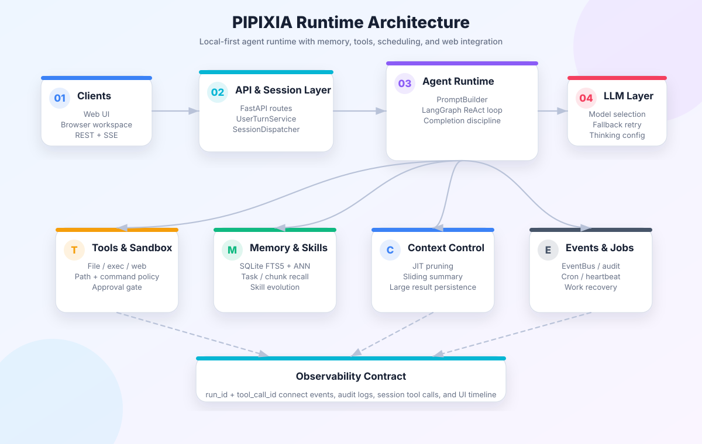
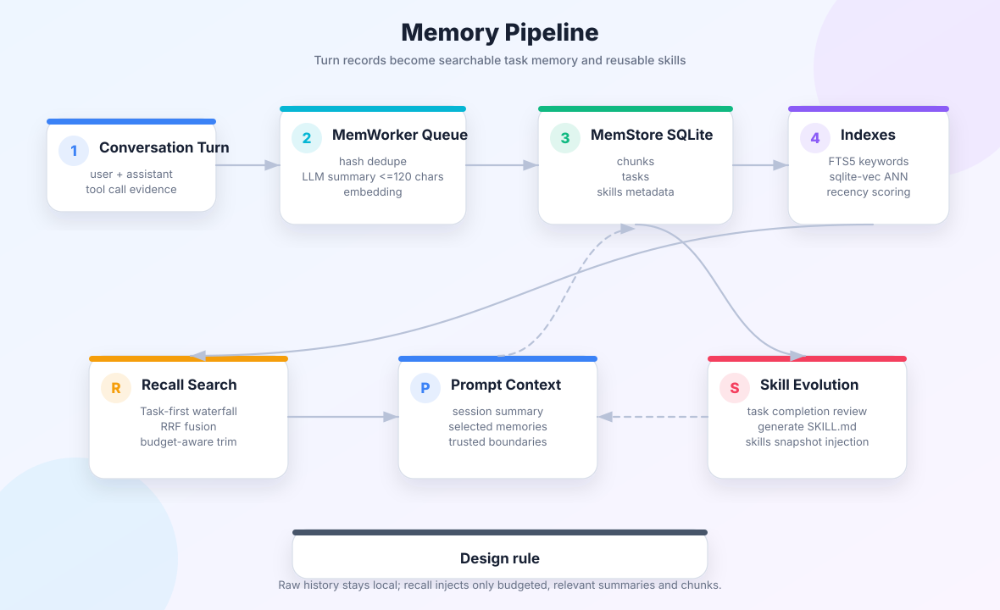
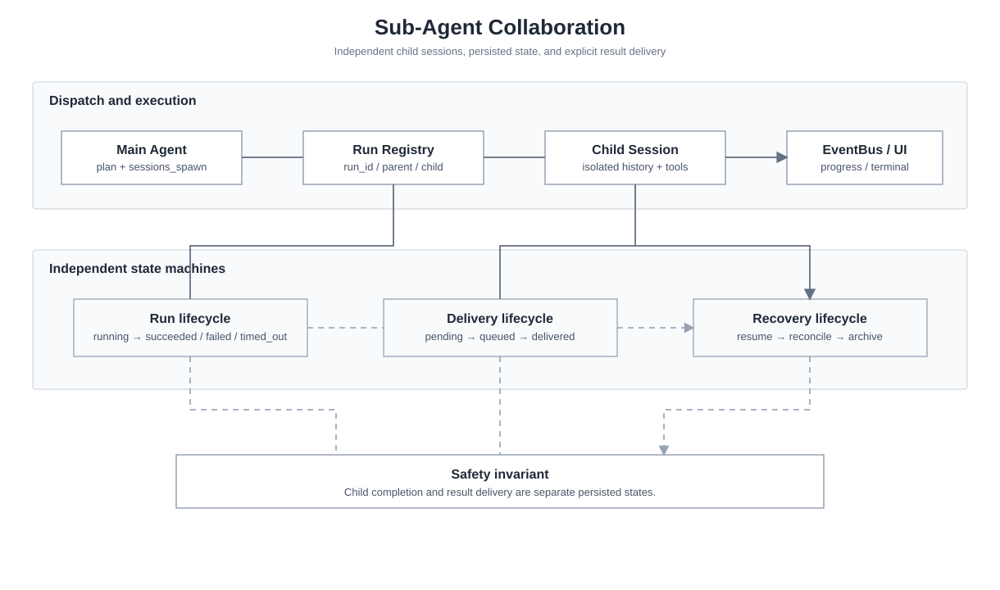
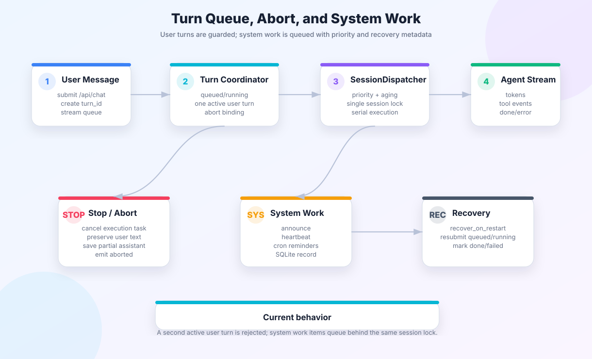

<div align="center">
  
  <h1>PIPIXIA</h1>
  <p>
    
    
  </p>
</div>

---

**PIPIXIA** is a local-first AI Agent system built with Python + LangChain/LangGraph, featuring multi-agent collaboration, persistent memory, automatic context management, and a web interface.

[中文](README.md) | [中文简洁版](README.zh-CN.md)

---

## Architecture

<p align="center">
  
</p>

| Layer | Technology |
|---|---|
| Backend | Python 3.11+ · FastAPI · LangChain / LangGraph |
| Frontend | Next.js · React · TypeScript |
| Storage | SQLite (FTS5 full-text + sqlite-vec vector) · Local filesystem |

---

## Capabilities

| Capability | What it does |
|---|---|
| Agent runtime | LangGraph-based ReAct loop for prompts, tool events, context compaction, and completion discipline |
| Tool execution contract | `tool_call_id` connects tool_start / tool_end / audit / session records; failures are returned as structured results |
| Long-term memory | SQLite FTS5 + sqlite-vec dual indexing, task-first waterfall recall, and skill evolution |
| Sub-agent collaboration | Isolated child sessions, explicit run state, delivery state, restart recovery, and archiving |
| Local-first storage | Sessions, memory, persisted tool output, and audit logs stay in the local workspace by default |

---

## Core Design

### Memory System

PIPIXIA implements a **write-index-recall** three-phase memory architecture for persistent knowledge accumulation and precise retrieval.

**Write phase**: After each conversation turn, `MemWorker` asynchronously processes messages. An LLM generates structured summaries (≤120 chars) while SHA-256 hashing prevents duplicate entries. Summarization and deduplication use lightweight models (e.g. qwen-plus) for high-frequency, low-cost operation.

**Index phase**: Each memory chunk is dual-indexed — SQLite FTS5 for keyword matching and sqlite-vec for semantic similarity search. The two indexes complement each other, covering both "what the user said" and "what the user meant."

**Recall phase**: The `MemRecall` engine uses a waterfall search strategy, searching Tasks → Chunks by priority within a total character budget (40,000 chars). Retrieved context is injected into the system prompt, giving the Agent cross-session long-term memory.

The system also supports **Skill Evolution**: `MemSkillEvolver` extracts reusable operational skills from conversation history through a multi-stage LLM pipeline (evaluate → generate → quality score), writing them as SKILL.md files that are automatically injected into the Agent's system prompt.

<p align="center">
  
</p>

### Context Management

All context control parameters are managed by a single `frozen=True` `ContextBudget` dataclass. Every component reads from `resolve_budget(agent_id)` — zero hardcoded values.

**Budget allocation**: In a 200K token context window, 20% is reserved for model thinking, 80% for active context. The active portion is further divided into session summary (5%) and conversation history. Per-file limit is 20,000 characters.

**Three-tier compaction**:
- **JIT pruning**: Before each request, old tool outputs are truncated by threshold to prevent a single large grep/read from filling the context
- **Sliding summary**: Triggered at 80% of the active window — the LLM compresses old conversations into structured summaries
- **Forced compaction**: Triggered at 95% — ensures the model's context window is never exceeded

**Zero-change model switching**: Change `contextTokens` in config, and all ratios scale proportionally. The `frozen` attribute ensures runtime immutability, preventing threshold inconsistencies between components.

### Sub-Agent Collaboration

The main Agent spawns sub-agents via `sessions_spawn`, each with an isolated session and toolset. Sub-agent lifecycle is governed by an **explicit state machine** (`running → succeeded/failed/timed_out/cancelled → archived`) — invalid transitions raise immediately.

Result delivery uses a separate announce state machine (`pending → queued → delivering → delivered`) with timeout retry and fallback write. All events flow through a **standardized event bus** with 23 event types built by the `Events` factory class.

<p align="center">
  
</p>

### Interrupt and Queuing

<p align="center">
  
</p>

Each session allows only one active user turn. System work items (announce / heartbeat / cron) enter the unified dispatcher queue and execute serially by priority plus aging. Stop requests abort the current run, preserve partial results when possible, and return a terminal state.

---

## Backend Structure

```
backend/
├── runtime/        # Agent runtime core (prompts, tool events, context compaction)
├── turns/          # User turn lifecycle and streaming output
├── sessions/       # Session storage, queue dispatching, system work delivery
├── subagents/      # Sub-agent registry, result delivery, resume, archive
├── infra/          # Cross-cutting concerns (event bus, state machine, audit, token counting)
├── llm/            # LLM layer (model config, selection, failover, retry)
├── mem/            # Memory system (storage, indexing, recall, skill evolution)
├── tools/          # Tool definitions (file, exec, web, memory, sub-agent)
├── sandbox/        # Security sandbox (path policy, exec policy, approvals)
├── scheduler/      # Scheduled tasks (cron scheduling, task store)
├── tool_results/   # Tool result persistence and preview
├── api/            # FastAPI routes
├── config.py       # Configuration management
└── app.py          # Application entry point
```

---

## Quick Start

### One-command start (recommended)

```bash
python scripts/dev.py
```

First run: configure via Web UI after startup, or run `cd backend && python cli.py onboard` first.

### Manual start

```bash
# Backend
cd backend
pip install -r requirements.txt
python cli.py start

# Frontend
cd frontend
npm install
npm run dev
```

Open: <http://localhost:3000>

## License

MIT
