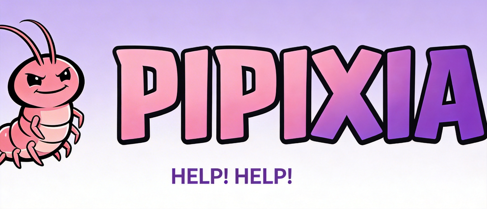
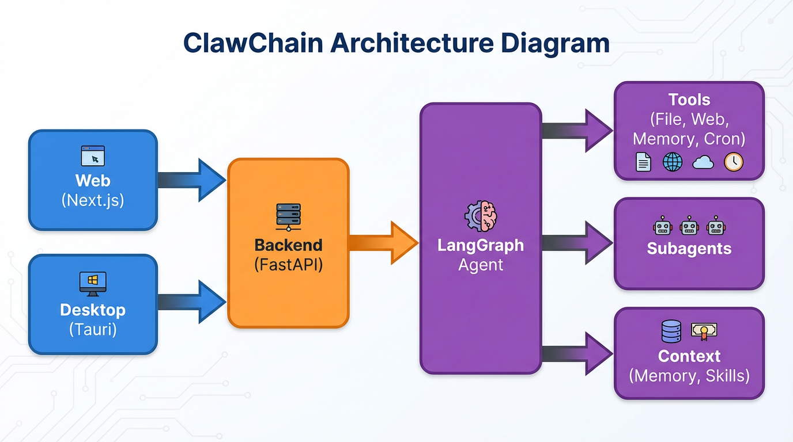
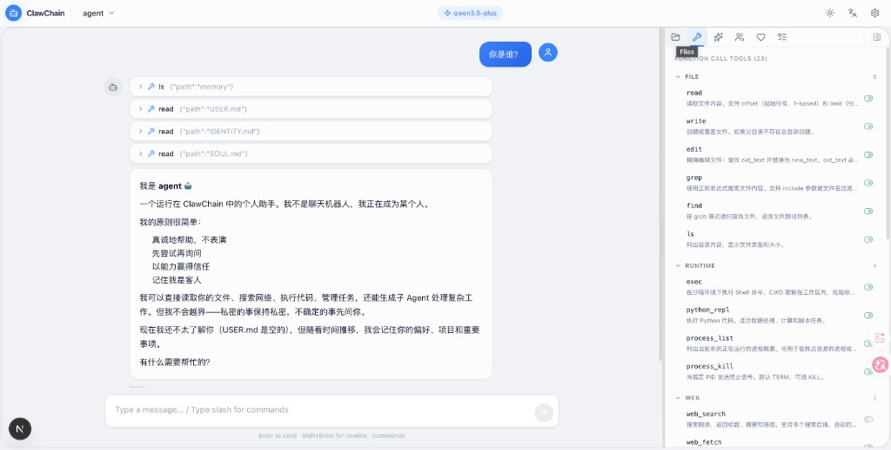
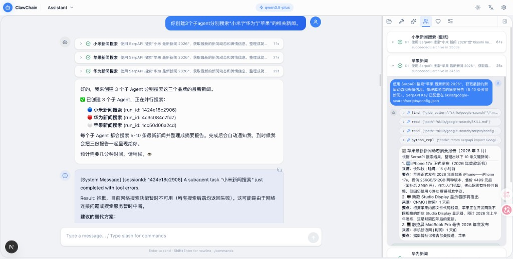
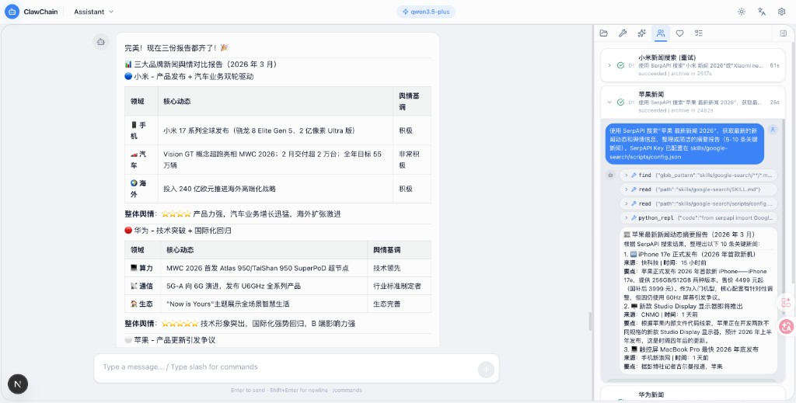
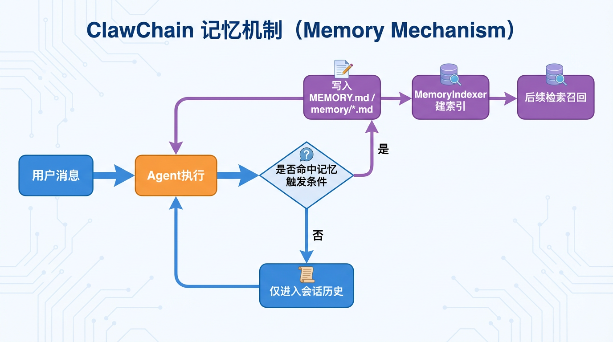
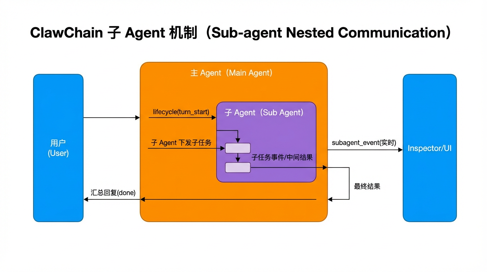
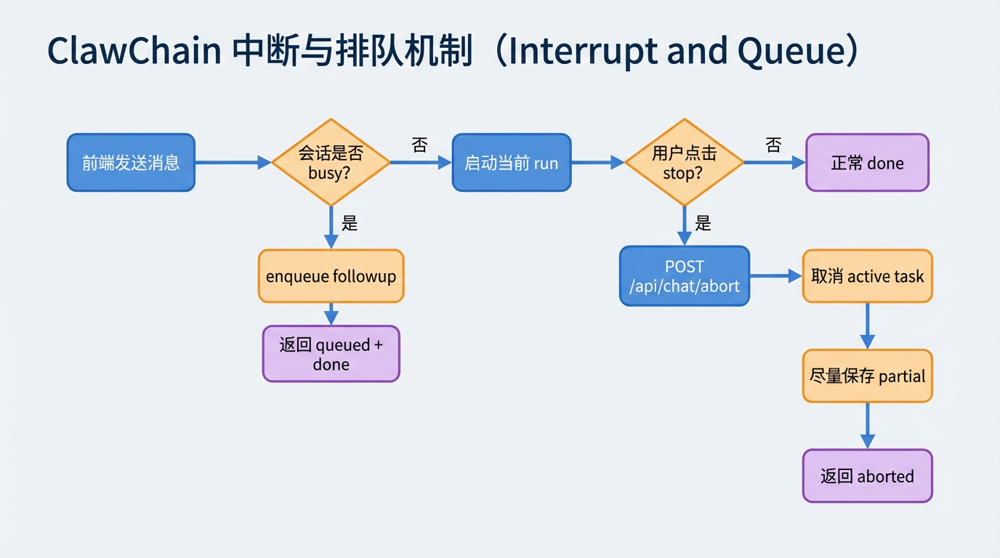

<div align="center">
  
  <h1>Pipixia</h1>
  <p>
    
    
  </p>
</div>

---

**Pipixia** 是一个本地优先的 AI Agent 系统，基于 Python + LangChain/LangGraph 构建，支持多 Agent 协作、持久化记忆、自动上下文管理和桌面端集成。

[English](README.en.md) | [中文简洁版](README.zh-CN.md)

---

## 架构总览

<p align="center">
  
</p>

| 层 | 技术 |
|---|---|
| 后端 | Python 3.11+ · FastAPI · LangChain / LangGraph |
| 前端 | Next.js · React · TypeScript |
| 桌面端 | Tauri 2.0 · Rust（托盘/窗口壳） |
| 存储 | SQLite（FTS5 全文 + sqlite-vec 向量）· 本地文件系统 |

---

## 界面展示

<table align="center">
  <tr align="center">
    <th><p align="center">Agent 自我介绍</p></th>
    <th><p align="center">子 Agent 并行协作</p></th>
    <th><p align="center">结构化报告输出</p></th>
  </tr>
  <tr>
    <td align="center"><p align="center"></p></td>
    <td align="center"><p align="center"></p></td>
    <td align="center"><p align="center"></p></td>
  </tr>
</table>

---

## 核心设计

### 记忆系统

Pipixia 的记忆系统采用 **写入-索引-召回** 三阶段架构，实现对话知识的持久化积累和精准检索。

**写入阶段**：每轮对话结束后，`MemWorker` 异步处理消息入库。通过 LLM 对原始对话生成 120 字符以内的结构化摘要，同时进行 SHA-256 哈希去重，避免重复写入。摘要和去重判断使用小模型（如 qwen-plus）执行，保证高频低成本。

**索引阶段**：入库的记忆 chunk 同时建立两套索引 —— SQLite FTS5 全文索引用于关键词精确匹配，sqlite-vec 向量索引用于语义相似度检索。双索引互补，覆盖"用户说过什么"和"用户意图是什么"两种检索场景。

**召回阶段**：`MemRecall` 引擎采用瀑布式搜索策略，按 Tasks → Chunks 优先级逐层检索，设置总字符预算（40,000 字符），在预算内尽可能召回最相关的上下文。召回结果注入到当前对话的系统提示词中，使 Agent 具备跨会话的长期记忆能力。

此外，系统支持 **技能演化**（Skill Evolution）：`MemSkillEvolver` 通过多阶段 LLM 流水线（评估 → 生成 → 质量评分）从历史对话中提炼可复用的操作技能，写入 SKILL.md 文件后自动注入 Agent 的系统提示词。

<p align="center">
  
</p>

### 上下文管理

所有上下文控制参数统一由一个 `frozen=True` 的 `ContextBudget` dataclass 管理，系统内所有组件通过 `resolve_budget(agent_id)` 获取参数，零硬编码。

**预算分配**：200K token 上下文窗口中，20% 预留给模型思考（thinking_reserve），80% 为活跃上下文（active_ratio）。活跃部分进一步细分为会话摘要（5%）和对话历史。单个文件限制 20,000 字符。

**三级压缩机制**：
- **JIT 裁剪**：每轮发送前，对旧的工具输出按阈值截断，防止单次大型 grep/read 占满上下文
- **滑动摘要**：当上下文达到活跃窗口的 80% 时自动触发，LLM 将旧对话压缩为结构化摘要
- **强制压缩**：达到 95% 时强制执行，确保永远不会超出模型上下文窗口

**换模型零改动**：修改配置中的 `contextTokens` 一个值，所有比率自动等比缩放。dataclass 的 `frozen` 属性保证运行时不可变，避免组件间阈值不一致。

### 子 Agent 协作

主 Agent 通过 `sessions_spawn` 工具创建子 Agent，每个子 Agent 拥有独立会话和工具集。子 Agent 运行状态通过 **显式状态机** 管理（`running → succeeded/failed/timed_out/cancelled → archived`），非法状态转换直接报错，防止隐式状态污染。

结果投递采用独立的投递状态机（`pending → queued → delivering → delivered`），支持超时重试和降级写入。所有事件通过 **标准化事件总线** 发送，23 种事件类型由 `Events` 工厂类统一构建，消除裸 dict 拼写风险。

<p align="center">
  
</p>

### 中断与排队

<p align="center">
  
</p>

会话 busy 时新消息进入 followup 队列；用户点击 stop 时调用 abort 取消当前 run，保存 partial 结果并返回终态。

---

## 后端目录结构

```
backend/
├── graph/          # Agent 运行时核心（会话、提示词、子 Agent、心跳）
├── infra/          # 横切关注点（事件总线、状态机、审计、token 计数）
├── llm/            # LLM 调用层（模型配置、选择、failover、重试）
├── mem/            # 记忆系统（存储、索引、召回、技能演化）
├── tools/          # 工具定义（文件、命令、网络、记忆、子 Agent）
├── sandbox/        # 安全沙箱（路径策略、执行策略、审批）
├── scheduler/      # 定时任务（Cron 调度、任务存储）
├── tool_results/   # 工具结果落盘与预览
├── api/            # FastAPI 路由
├── config.py       # 配置管理
└── app.py          # 应用入口
```

---

## 快速开始

### 一键启动（推荐）

```bash
python scripts/dev.py
```

首次使用通过 Web 配置中心完成，或先运行 `cd backend && python cli.py onboard`。

### 单独启动

```bash
# 后端
cd backend
pip install -r requirements.txt
python cli.py start

# 前端
cd frontend
npm install
npm run dev
```

浏览器打开：<http://localhost:3000>

---

## Desktop（macOS Alpha）

```bash
cd desktop
npm install
npm run doctor
npm run dev
```

托盘常驻、关闭窗口隐藏到后台、sidecar 双路径启动、后端健康检查与就绪等待。

---

## License

MIT
