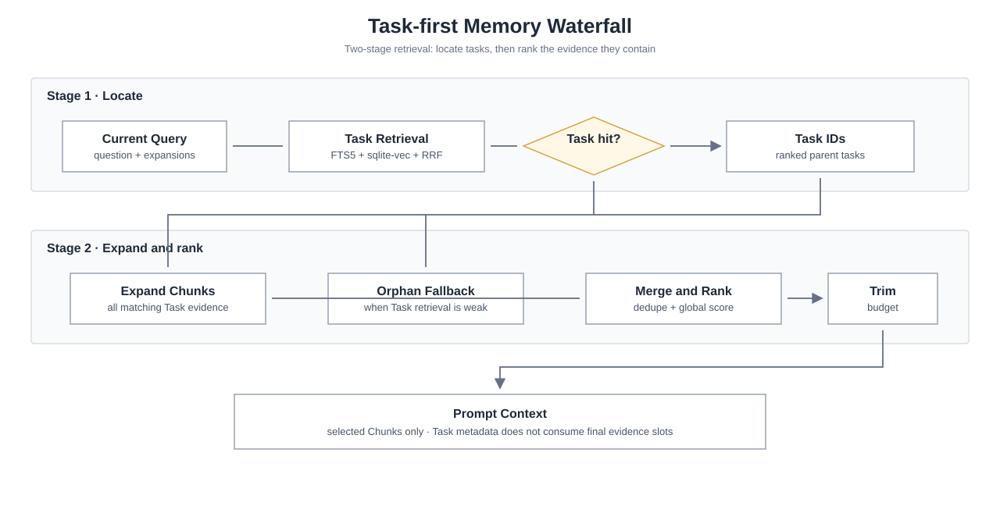
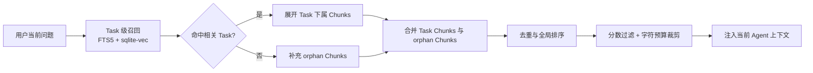
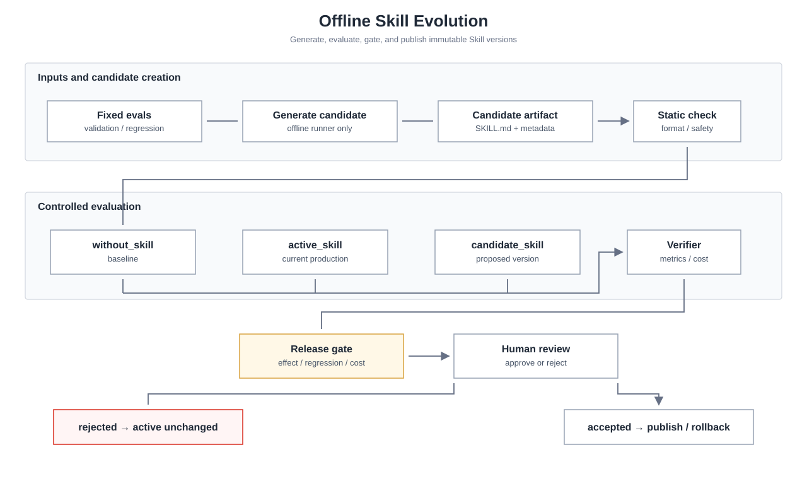
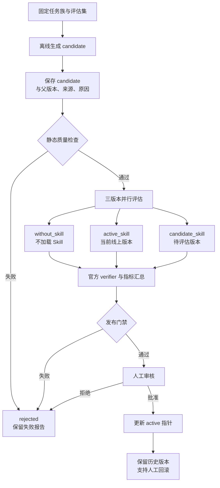

<div align="center">
  
  <h1>PIPIXIA</h1>
  <p>
    
    
  </p>
</div>

---

**PIPIXIA** 是一个本地优先的 AI Agent 系统，基于 Python + LangChain/LangGraph 构建，支持多 Agent 协作、持久化记忆、自动上下文管理和 Web 端交互。

[English](README.en.md) | [中文简洁版](README.zh-CN.md)

---

## 架构总览

<p align="center">
  
</p>

| 层 | 技术 |
|---|---|
| 后端 | Python 3.11+ · FastAPI · LangChain / LangGraph |
| 前端 | Next.js · React · TypeScript |
| 存储 | SQLite（FTS5 全文 + sqlite-vec 向量）· 本地文件系统 |

---

## 能力概览

| 能力 | 说明 |
|---|---|
| Agent 运行时 | 基于 LangGraph 的 ReAct 循环，统一管理提示词、工具事件、上下文压缩与完成纪律 |
| 工具执行闭环 | `tool_call_id` 串联 tool_start / tool_end / audit / session 记录，失败也结构化回传 |
| 长期记忆 | SQLite FTS5 + sqlite-vec 双索引，Task-first 瀑布式召回，支持离线 Skill 进化 |
| 子 Agent 协作 | 独立会话、显式状态机、结果投递状态机、重启恢复与归档 |
| 本地优先 | 会话、记忆、工具输出、审计日志默认落在本地工作区 |

---

## 核心设计

### 记忆系统

PIPIXIA 的记忆系统采用 **写入-索引-召回** 三阶段架构，实现对话知识的持久化积累和精准检索。

**写入阶段**：每轮对话结束后，`MemWorker` 异步处理消息入库。通过 LLM 对原始对话生成 120 字符以内的结构化摘要，同时进行 SHA-256 哈希去重，避免重复写入。摘要和去重判断使用小模型（如 qwen-plus）执行，保证高频低成本。

**索引阶段**：入库的记忆 chunk 同时建立两套索引 —— SQLite FTS5 全文索引用于关键词精确匹配，sqlite-vec 向量索引用于语义相似度检索。双索引互补，覆盖"用户说过什么"和"用户意图是什么"两种检索场景。

**召回阶段**：`MemRecall` 引擎采用 **Task-first 瀑布展开**：先用 FTS5 + 向量索引定位相关 Task，再展开命中 Task 下的全部候选 Chunk，最后将 Task Chunk 与 orphan Chunk 合并去重、全局排序和预算裁剪。Task 元数据只负责定位，不占用最终 Chunk 召回槽位；在总字符预算内尽可能保留最相关的证据，随后注入当前对话系统提示词。

### Task-first 瀑布展开

Task 瀑布展开把“先找哪段历史任务”和“任务中哪些证据最相关”拆成两个阶段，降低长对话检索噪声，并让最终上下文直接由 Chunk 证据组成。

<p align="center">
  
</p>



### Skill 离线进化

Skill 不在用户任务完成时直接修改生产文件。线上运行只加载当前 active Skill 并完成任务；Skill 的创建、升级和发布由离线流程完成。每个 candidate 都必须经过静态检查、`without / active / candidate` 三版本对照、业务 verifier、validation / regression 和成本门禁，人工确认后才能成为 active。

<p align="center">
  
</p>



第一期离线命令示例：

```bash
# 生成离线 candidate
python -m evaluation.skilllearnbench_runner distill \
  --manifest data/evaluation/skilllearnbench/manifest.json \
  --family organize-messy-files \
  --trajectory <successful-trajectory.jsonl> \
  --skill-out data/evaluation/skilllearnbench/skills \
  --json-out data/evaluation/skilllearnbench/distill.json \
  --candidate

# 对 candidate 执行三版本评估，再运行门禁和人工发布
python -m evaluation.skilllearnbench_runner evaluate ...
python -m evaluation.skill_evolution_runner gate ...
python -m evaluation.skill_evolution_runner publish ...
```

线上任务不会触发 Skill 自动生成或升级；`auto_evaluate` 默认关闭，离线 runner 是第一期唯一的 Skill 进化入口。

<p align="center">
  
</p>

### 上下文管理

所有上下文控制参数统一由一个 `frozen=True` 的 `ContextBudget` dataclass 管理，系统内所有组件通过 `resolve_budget(agent_id)` 获取参数，零硬编码。

**预算分配**：200K token 上下文窗口中，20% 预留给模型思考（thinking_reserve），80% 为活跃上下文（active_ratio）。活跃部分进一步细分为会话摘要（5%）和对话历史。单个文件限制 20,000 字符。

**三级压缩机制**：
- **JIT 裁剪**：每轮发送前，对旧的工具输出按阈值截断，防止单次大型 grep/read 占满上下文
- **滑动摘要**：当上下文达到活跃窗口的 80% 时自动触发，LLM 将旧对话压缩为结构化摘要
- **强制压缩**：达到 95% 时强制执行，确保永远不会超出模型上下文窗口

**换模型零改动**：修改配置中的 `contextTokens` 一个值，所有比率自动等比缩放。dataclass 的 `frozen` 属性保证运行时不可变，避免组件间阈值不一致。

### 子 Agent 协作

主 Agent 通过 `sessions_spawn` 工具创建子 Agent，每个子 Agent 拥有独立会话和工具集。子 Agent 运行状态通过 **显式状态机** 管理（`running → succeeded/failed/timed_out/cancelled → archived`），非法状态转换直接报错，防止隐式状态污染。

结果投递采用独立的投递状态机（`pending → queued → delivering → delivered`），支持超时重试和降级写入。所有事件通过 **标准化事件总线** 发送，23 种事件类型由 `Events` 工厂类统一构建，消除裸 dict 拼写风险。

<p align="center">
  
</p>

### 中断与排队

<p align="center">
  
</p>

同一会话只允许一个活跃用户 turn；系统类工作项（announce / heartbeat / cron）进入统一 dispatcher 队列，按优先级和 aging 串行执行。用户点击 stop 时调用 abort 取消当前 run，尽量保存 partial 结果并返回终态。

---

## 后端目录结构

```
backend/
├── runtime/        # Agent 运行时核心（提示词、工具事件、上下文压缩）
├── turns/          # 用户 turn 生命周期与流式输出
├── sessions/       # 会话存储、队列调度、系统工作项投递
├── subagents/      # 子 Agent 注册表、结果投递、恢复与归档
├── infra/          # 横切关注点（事件总线、状态机、审计、token 计数）
├── llm/            # LLM 调用层（模型配置、选择、failover、重试）
├── mem/            # 记忆系统（存储、索引、召回、技能演化）
├── evaluation/     # 离线评估（SkillLearnBench、LoCoMo、发布门禁）
├── tools/          # 工具定义（文件、命令、网络、记忆、子 Agent）
├── sandbox/        # 安全沙箱（路径策略、执行策略、审批）
├── scheduler/      # 定时任务（Cron 调度、任务存储）
├── tool_results/   # 工具结果落盘与预览
├── api/            # FastAPI 路由
├── config.py       # 配置管理
└── app.py          # 应用入口
```

离线 Skill 评估数据与线上 Skill 文件分离：

```text
backend/data/
├── skills/                  # 线上只读取的 active Skill
└── evaluation/
    ├── skilllearnbench/     # 固定任务、候选评估和 benchmark 清单
    └── locomo/              # 记忆召回评估数据
```

---

## 快速开始

### 一键启动（推荐）

```bash
python3 scripts/dev.py
```

首次使用通过 Web 配置中心完成，或先运行 `cd backend && python3 cli.py onboard`。

### 单独启动

```bash
# 后端
cd backend
python3 -m pip install -r requirements.txt
python3 cli.py start

# 前端
cd frontend
npm install
npm run dev
```

浏览器打开：<http://localhost:3000>

### 质量检查

```bash
# 后端
python3 -m unittest discover -s backend/tests -p "test_*.py"

# 前端
cd frontend
npm test
npx tsc --noEmit
npm run lint
npm run build
```

## License

MIT
