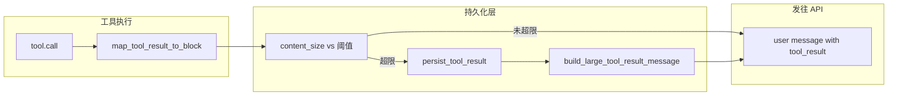

# 工具输出「落盘 + 预览」完整实现方案（Python）

本文档描述如何用 **Python** 在智能体/对话系统中实现**大工具结果不落全文进上下文、而是写入磁盘并仅向模型返回路径与预览**。与 [Anthropic Messages API](https://docs.anthropic.com) 的 `tool_result` 块兼容。算法与常量与 Claude Code 参考实现（TypeScript：`src/utils/toolResultStorage.ts` 等）一致，便于对照；落地代码以 Python 为准。

---

## 1. 目标与非目标

### 1.1 目标

- 控制单次/单轮对话中**工具结果占用的 token**，避免撑爆上下文或 API 限制。
- **不丢失**完整输出：全文保存在会话可访问路径，模型可通过 **read_file** 等工具按需拉取。
- 行为在**多轮重放**（compact、resume）时**稳定、可复现**（幂等写盘、替换文案可缓存）。

### 1.2 非目标

- 不替代「模型输出长度限制」或「整段对话 compact」。
- 不要求在落盘层做语义摘要（可作为可选增强）。

---

## 2. 总体架构



- **唯一入口**：所有工具结果在并入 `user` 消息前，经过 `process_tool_result_block`（或等价函数）。
- **Shell 特例**：stdout 已写入临时大文件时，可先 **link/copy** 到 `tool-results/`，再在 `map_tool_result` 中直接生成 `<persisted-output>`，避免整文件读入内存。

---

## 3. 推荐项目结构（Python）

```
your_agent/
  tool_results/
    __init__.py
    constants.py      # 阈值、预览长度
    models.py         # TypedDict / dataclass
    storage.py        # 路径、写盘、预览、组装消息
    pipeline.py       # maybe_persist、process_tool_result_block
```

---

## 4. 常量与类型

### 4.1 常量

| 名称 | 典型值 | 含义 |
|------|--------|------|
| `DEFAULT_MAX_RESULT_SIZE_CHARS` | `50_000` | 全局默认；与各工具 `max_result_size_chars` 取 `min` |
| `PREVIEW_SIZE_CHARS` | `2000` | 预览字符数上限 |
| `TOOL_RESULTS_SUBDIR` | `"tool-results"` | 会话目录下子目录 |
| `MAX_PERSISTED_FILE_BYTES` | `64 * 1024 * 1024` | 单文件上限（Shell 复制前可 truncate） |

### 4.2 数据类型（`typing` + `dataclasses`）

```python
from __future__ import annotations

from dataclasses import dataclass
from typing import Any, Literal, TypedDict


class TextBlock(TypedDict):
    type: Literal["text"]
    text: str


# Anthropic API: tool_result content 可为 str 或 content block 列表
ToolResultContent = str | list[TextBlock | dict[str, Any]]


@dataclass(frozen=True)
class PersistedToolResult:
    filepath: str
    original_size: int
    is_json: bool
    preview: str
    has_more: bool


@dataclass(frozen=True)
class PersistToolResultError:
    error: str


PersistOutcome = PersistedToolResult | PersistToolResultError
```

### 4.3 工具协议（`Protocol`）

```python
from typing import Protocol


class Tool(Protocol):
    name: str
    max_result_size_chars: float  # math.inf 表示不参与落盘

    def map_tool_result_to_block(
        self, result: Any, tool_use_id: str
    ) -> dict[str, Any]:
        """返回符合 API 的 tool_result 结构，至少含 tool_use_id, type, content。"""
        ...
```

### 4.4 替换消息格式

- 开始：`<persisted-output>`
- 结束：`</persisted-output>`

正文结构：

1. 一行：`Output too large ({human_size}). Full output saved to: {abs_path}`
2. 空行
3. `Preview (first {n}):` + 预览
4. 若有更多：末尾 `\n...\n`

---

## 5. 路径与文件命名

### 5.1 目录

使用 **`pathlib.Path`**：

```python
from pathlib import Path

def get_tool_results_dir(project_root: Path, session_id: str) -> Path:
    return project_root / session_id / "tool-results"


def ensure_tool_results_dir(directory: Path) -> None:
    directory.mkdir(parents=True, exist_ok=True)
```

### 5.2 文件名

- 纯字符串：`{tool_use_id}.txt`
- 多块 text 序列化：`{tool_use_id}.json`

`tool_use_id` 在单次会话内唯一（通常即 API 返回的 id）。

### 5.3 Shell 大文件

- 临时文件 → `shutil.copy2` 或 `os.link`（同分区）到 `tool-results/{task_id}.txt`。
- 超过 `MAX_PERSISTED_FILE_BYTES` 时先 `path.open("r+b")` 截断或 `truncate` 再复制。

---

## 6. 核心算法（Python）

### 6.1 `content_size(content: ToolResultContent) -> int`

```python
def content_size(content: ToolResultContent) -> int:
    if isinstance(content, str):
        return len(content)
    total = 0
    for block in content:
        if isinstance(block, dict) and block.get("type") == "text":
            total += len(block.get("text") or "")
    return total


def has_image_block(content: ToolResultContent) -> bool:
    if isinstance(content, str):
        return False
    return any(
        isinstance(b, dict) and b.get("type") == "image"
        for b in content
    )
```

### 6.2 `get_persistence_threshold(tool_name, declared_max, overrides)`

```python
import math

DEFAULT_MAX_RESULT_SIZE_CHARS = 50_000


def get_persistence_threshold(
    tool_name: str,
    declared_max: float,
    overrides: dict[str, int] | None = None,
) -> float:
    if not math.isfinite(declared_max):
        return declared_max
    eff = min(declared_max, DEFAULT_MAX_RESULT_SIZE_CHARS)
    if overrides and tool_name in overrides:
        v = overrides[tool_name]
        if isinstance(v, int) and v > 0:
            return float(v)
    return float(eff)
```

### 6.3 `generate_preview(text: str, max_chars: int) -> tuple[str, bool]`

```python
def generate_preview(text: str, max_chars: int) -> tuple[str, bool]:
    if len(text) <= max_chars:
        return text, False
    truncated = text[:max_chars]
    last_nl = truncated.rfind("\n")
    if last_nl > max_chars * 0.5:
        cut = last_nl
    else:
        cut = max_chars
    return text[:cut], True
```

### 6.4 独占创建写盘（等价 Node `flag: 'wx'`）

使用 **`open(..., "x")`**，已存在时抛出 **`FileExistsError`**：

```python
import json
from pathlib import Path


PERSISTED_OUTPUT_OPEN = "<persisted-output>"
PERSISTED_OUTPUT_CLOSE = "</persisted-output>"
PREVIEW_SIZE_CHARS = 2000


def _content_to_write_string(content: ToolResultContent) -> tuple[str, bool]:
    if isinstance(content, str):
        return content, False
    # 仅含 text 块时可序列化；含 image 应在调用前跳过
    return json.dumps(content, ensure_ascii=False, indent=2), True


def persist_tool_result(
    content: ToolResultContent,
    tool_use_id: str,
    tool_results_dir: Path,
) -> PersistOutcome:
    if isinstance(content, list):
        if any(
            isinstance(b, dict) and b.get("type") != "text"
            for b in content
        ):
            return PersistToolResultError(
                error="Cannot persist tool results containing non-text blocks"
            )

    ensure_tool_results_dir(tool_results_dir)
    content_str, is_json = _content_to_write_string(content)
    ext = "json" if is_json else "txt"
    filepath = tool_results_dir / f"{tool_use_id}.{ext}"

    try:
        with filepath.open("x", encoding="utf-8") as f:
            f.write(content_str)
    except FileExistsError:
        pass  # 已存在：幂等，不覆盖
    except OSError as e:
        return PersistToolResultError(error=str(e))

    preview, has_more = generate_preview(content_str, PREVIEW_SIZE_CHARS)
    return PersistedToolResult(
        filepath=str(filepath.resolve()),
        original_size=len(content_str),
        is_json=is_json,
        preview=preview,
        has_more=has_more,
    )
```

### 6.5 `build_large_tool_result_message(result: PersistedToolResult) -> str`

```python
def _human_char_count(n: int) -> str:
    """展示工具结果字符量（与 token/字节区分时可改名）。"""
    if n < 1024:
        return f"{n} characters"
    if n < 1024 * 1024:
        return f"{n / 1024:.1f} KB"
    return f"{n / (1024 * 1024):.1f} MB"


def build_large_tool_result_message(result: PersistedToolResult) -> str:
    lines = [
        PERSISTED_OUTPUT_OPEN,
        (
            f"Output too large ({_human_char_count(result.original_size)}). "
            f"Full output saved to: {result.filepath}"
        ),
        "",
        f"Preview (first {PREVIEW_SIZE_CHARS} chars):",
        result.preview,
    ]
    if result.has_more:
        lines.extend(["", "..."])
    lines.append(PERSISTED_OUTPUT_CLOSE)
    return "\n".join(lines)
```

### 6.6 `maybe_persist_large_tool_result` → 替换 `tool_result` 的 `content`

```python
def is_tool_result_empty(content: ToolResultContent | None) -> bool:
    if content is None:
        return True
    if isinstance(content, str):
        return content.strip() == ""
    if not content:
        return True
    return all(
        isinstance(b, dict)
        and b.get("type") == "text"
        and not (b.get("text") or "").strip()
        for b in content
    )


def maybe_persist_large_tool_result(
    block: dict[str, Any],
    tool_name: str,
    threshold: float,
    tool_results_dir: Path,
) -> dict[str, Any]:
    content = block.get("content")
    if is_tool_result_empty(content):
        return {
            **block,
            "content": f"({tool_name} completed with no output)",
        }
    if has_image_block(content):  # type: ignore[arg-type]
        return block
    if content_size(content) <= threshold:  # type: ignore[arg-type]
        return block

    outcome = persist_tool_result(content, block["tool_use_id"], tool_results_dir)
    if isinstance(outcome, PersistToolResultError):
        return block  # 或改为返回错误字符串，按产品定

    return {**block, "content": build_large_tool_result_message(outcome)}
```

### 6.7 `process_tool_result_block`（统一入口）

```python
async def process_tool_result_block(
    tool: Tool,
    tool_use_result: Any,
    tool_use_id: str,
    tool_results_dir: Path,
    overrides: dict[str, int] | None = None,
) -> dict[str, Any]:
    block = tool.map_tool_result_to_block(tool_use_result, tool_use_id)
    thr = get_persistence_threshold(
        tool.name, tool.max_result_size_chars, overrides
    )
    return maybe_persist_large_tool_result(
        block, tool.name, thr, tool_results_dir
    )
```

同步版本去掉 `async` 即可；若工具 `call` 已是 async，可在 `await tool.call(...)` 之后直接调用上述逻辑。

---

## 7. 与执行器集成（Python）

在「工具执行完成 → 构造 user message」的单一位置调用：

```python
# 伪代码
block = await process_tool_result_block(
    tool, raw_result, tool_use_id, get_tool_results_dir(project_root, session_id)
)
user_message_content.append(block)
```

若 Post-tool Hook 已得到映射后的 `block`，则只调用 `maybe_persist_large_tool_result(block, tool_name, threshold, dir)`，不再调用 `map`。

---

## 8. Shell 工具特化

1. 子进程 stdout 超内存上限时写入**临时文件**，内存只保留前缀（如 30k 字符）。
2. 返回结构中带 `persisted_output_path: Path | None` 与可选 `persisted_output_size`。
3. 在 `map_tool_result_to_block` 中：若 `persisted_output_path` 存在，对内存中的前缀做 `generate_preview`，**不要**拼接全文；`content` 设为 `build_large_tool_result_message(...)`。
4. 检测 `content.startswith("<persisted-output>")` 可避免聚合预算阶段重复处理。

---

## 9. 可选：单条 user 消息内总预算

- 常量示例：`MAX_TOOL_RESULTS_PER_MESSAGE_CHARS = 200_000`。
- 对同一轮合并后的 user 消息内各 `tool_result` 的 `content_size` 求和；超限则对**未处理过的最大块**先 `persist_tool_result` 并替换，直到总和 ≤ 上限。
- 用 `dict[tool_use_id, replacement_str]` 记录已替换内容，保证重放一致。

MVP 可省略，仅 per-tool 落盘即可。

---

## 10. MCP / HTTP 客户端

- 收到超长文本时复用 `persist_tool_result`。
- 失败时返回明确错误，并提示分页/过滤（与 TS 版 `mcp/client` 行为一致）。

---

## 11. 安全与生命周期

| 项目 | Python 提示 |
|------|-------------|
| 路径 | 使用 `Path.resolve()`；禁止未校验的用户字符串作为绝对路径根 |
| 权限 | `os.chmod` 按需收紧；避免全局可写 |
| 清理 | `tempfile` + 会话结束删除，或 `atexit` / 定时任务清理 `{session_id}` |
| 大文件 | `os.truncate` 或写环形缓冲前截断 |

---

## 12. 依赖建议

- 标准库即可：`pathlib`、`json`、`typing`、`dataclasses`。
- 若与 **Anthropic SDK**：`pip install anthropic`，消息体仍为 dict，上述 `block` 与 SDK 类型对齐即可。

---

## 13. 系统提示词建议

- 当出现 `<persisted-output>` 时，完整内容在所示路径；需要片段时使用 **read_file(offset=..., limit=...)** 或 **grep**，避免一次性读入超大文件。

---

## 14. 测试清单（`pytest`）

- [ ] 短结果：不写盘，原样。
- [ ] 略超阈值：独占创建成功，模型侧为预览 + 路径。
- [ ] 同 `tool_use_id` 第二次：`FileExistsError` 被吞，预览仍正确。
- [ ] 含 `image` block：不落盘。
- [ ] 空结果：占位符。
- [ ] `open("x")` 失败：降级策略。
- [ ] Shell `persisted_output_path`：无全文泄漏。

---

## 15. 最小实现顺序（MVP）

1. `constants.py` + `get_tool_results_dir` / `ensure_tool_results_dir`
2. `generate_preview` + `build_large_tool_result_message`
3. `persist_tool_result`（`open(..., "x")` 幂等）
4. `get_persistence_threshold` + `maybe_persist_large_tool_result` + `process_tool_result_block`
5. 在执行管线中统一调用（4）
6. 系统提示词（§13）
7. Shell 大文件（§8）与总预算（§9）

完成 1–5 即可覆盖大部分非 Shell 工具的长输出场景。

---

## 16. 参考：Claude Code（TypeScript）源码索引

若需对照行为细节：

| 文件 | 说明 |
|------|------|
| `src/utils/toolResultStorage.ts` | 持久化与聚合预算 |
| `src/constants/toolLimits.ts` | 默认阈值 |
| `src/services/tools/toolExecution.ts` | 统一入口 |
| `src/tools/BashTool/BashTool.tsx` | Shell 落盘路径 |

Python 方案在语义上与上述实现等价；API 细节以 Anthropic 文档为准。
