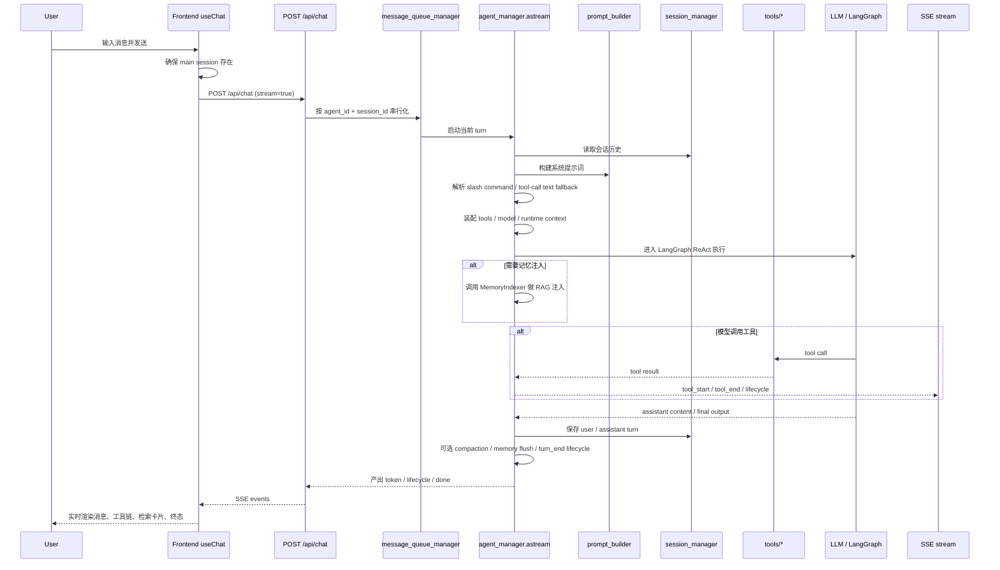
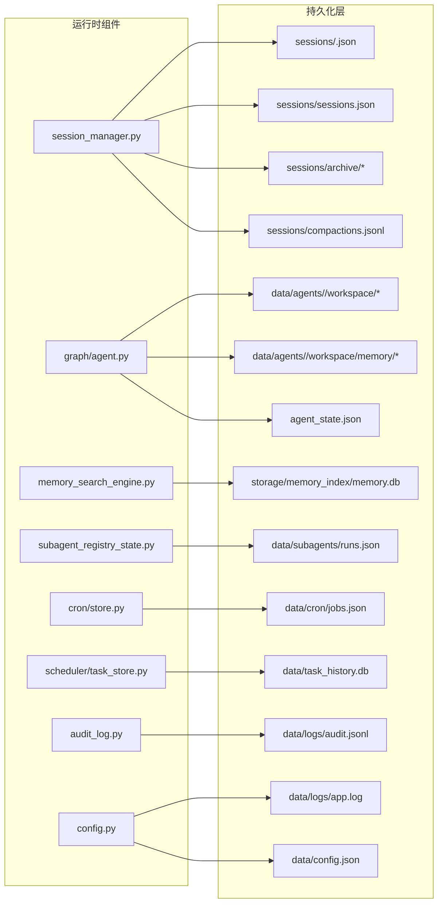

# 当前系统完整架构图

> summary: 基于当前仓库实现整理 ClawChain 的前后端、Agent 运行时、子代理、后台任务与存储架构
> read_when: 你要快速理解“用户消息如何进入系统、如何执行、如何持久化、如何在前后端之间流动”

## 说明

这份文档描述的是当前代码库中的“已实现架构”，不是未来规划图。

为保证可读性，完整架构被拆成四张图：

- 系统总览图
- 聊天主链路图
- 子代理与后台任务图
- 持久化与状态存储图

## 1. 系统总览图

```mermaid
flowchart TB
    User[用户]

    subgraph FE[Frontend / Next.js SPA]
        Page[app/page.tsx]
        Store[lib/store.tsx AppProvider]
        ChatHook[hooks/useChat.ts]
        SubHook[hooks/useSubagents.ts]
        ChatUI[ChatPanel / ChatMessage / ChatInput]
        Inspector[InspectorPanel / SubagentPanel / EventTimeline / TaskDashboard]
        ConfigUI[Navbar / ConfigModal / ApprovalModal]
    end

    subgraph BE[Backend / FastAPI]
        App[app.py]
        ChatAPI[api/chat.py]
        SessionAPI[api/sessions.py]
        AgentAPI[api/agents.py]
        EventsAPI[api/events.py]
        FilesAPI[api/files.py]
        ConfigAPI[api/config_api.py]
        CronAPI[api/cron_api.py]
        ApprovalsAPI[api/approvals.py]
    end

    subgraph RT[Agent Runtime / graph]
        Queue[message_queue.py]
        AgentMgr[graph/agent.py agent_manager]
        Prompt[prompt_builder.py]
        SessionMgr[session_manager.py]
        Cmd[command_parser.py]
        ToolParser[tool_call_parser.py]
        ToolInjector[tool_call_injector.py]
        LLM[llm_factory.py + model_selection.py]
        Tools[tools/__init__.py + tool modules]
        MemoryIdx[memory_indexer.py]
        MemorySearch[memory_search_engine.py]
        Subagents[subagent_registry.py + subagent_resume.py]
        Heartbeat[heartbeat.py]
    end

    subgraph BG[Background Systems]
        Skills[skills_scanner.py + skills_watcher.py]
        Cron[cron/scheduler.py]
        SysEvents[infra/system_events.py]
        ApprovalStore[approval_store.py]
        Audit[audit_log.py + run_tracker.py]
    end

    subgraph DATA[Data / Persistence]
        AgentData[data/agents/<agent>/]
        Sessions[sessions/*.json]
        MemoryDB[storage/memory_index/memory.db]
        TaskDB[data/task_history.db]
        SubagentState[data/subagents/runs.json]
        Logs[data/logs/* + audit.jsonl]
        CronJobs[data/cron/jobs.json]
        Config[data/config.json]
    end

    User --> ChatUI
    User --> ConfigUI
    ChatUI --> Store
    ConfigUI --> Store
    Inspector --> Store
    Store --> ChatHook
    Store --> SubHook
    Page --> Store

    ChatHook --> ChatAPI
    Store --> SessionAPI
    Store --> AgentAPI
    Store --> EventsAPI
    Store --> FilesAPI
    Store --> ConfigAPI
    Store --> CronAPI
    Store --> ApprovalsAPI
    SubHook --> EventsAPI

    App --> ChatAPI
    App --> SessionAPI
    App --> AgentAPI
    App --> EventsAPI
    App --> FilesAPI
    App --> ConfigAPI
    App --> CronAPI
    App --> ApprovalsAPI

    ChatAPI --> Queue
    Queue --> AgentMgr
    AgentMgr --> Cmd
    AgentMgr --> Prompt
    AgentMgr --> SessionMgr
    AgentMgr --> ToolParser
    AgentMgr --> ToolInjector
    AgentMgr --> LLM
    AgentMgr --> Tools
    AgentMgr --> MemoryIdx
    Tools --> MemorySearch
    AgentMgr --> Subagents
    EventsAPI --> Subagents
    Heartbeat --> AgentMgr
    Cron --> SysEvents
    SysEvents --> Heartbeat
    Tools --> ApprovalStore
    ApprovalStore --> ApprovalsAPI
    AgentMgr --> Audit

    SessionMgr --> Sessions
    MemorySearch --> MemoryDB
    AgentMgr --> AgentData
    Subagents --> SubagentState
    Cron --> CronJobs
    CronAPI --> TaskDB
    Audit --> Logs
    App --> Config
    Skills --> AgentData
```



## 2. 聊天主链路图



## 3. 子代理与后台任务图

```mermaid
flowchart TB
    subgraph MainTurn[主会话运行时]
        MainAgent[agent_manager.astream]
        AgentTools[tools/agent_tools.py]
        EventBus[agent event bus]
    end

    subgraph SubagentFlow[子代理执行链]
        Spawn[spawn / list / steer / kill]
        Registry[subagent_registry.py]
        Resume[subagent_resume.py]
        ChildSession[child session]
        ChildRun[subagent astream minimal prompt]
        Bubble[结果回传到父 session]
    end

    subgraph Background[后台自动化]
        Heartbeat[heartbeat.py]
        Cron[cron/scheduler.py]
        SystemEvents[infra/system_events.py]
        Archive[subagent archive]
        Skills[skills_scanner / skills_watcher]
        ApprovalStore[approval_store.py]
    end

    subgraph FrontendViews[前端运行态可视化]
        EventSSE[GET /api/agents/{agent}/events]
        SubagentUI[SubagentPanel / InlineCard / Navbar badge]
        HeartbeatUI[HeartbeatPanel]
        ApprovalUI[ApprovalModal]
    end

    MainAgent --> AgentTools
    AgentTools --> Spawn
    Spawn --> Registry
    Registry --> ChildSession
    ChildSession --> ChildRun
    ChildRun --> Bubble
    Bubble --> MainAgent
    Resume --> Registry

    Cron --> SystemEvents
    SystemEvents --> Heartbeat
    Heartbeat --> MainAgent
    Archive --> Registry
    Skills --> MainAgent
    AgentTools --> ApprovalStore
    ApprovalStore --> EventBus

    EventBus --> EventSSE
    Registry --> EventSSE
    Heartbeat --> EventSSE
    EventSSE --> SubagentUI
    EventSSE --> HeartbeatUI
    EventSSE --> ApprovalUI
```

## 4. 持久化与状态存储图



## 核心结论

- 前端本质上是一个单页控制台，核心是 `AppProvider` + `useChat` + agent 级 SSE 事件流
- 后端本质上是一个围绕 `agent_manager.astream(...)` 组织的 FastAPI + LangGraph 运行时
- 聊天主链路和后台事件链路是分开的：前者是 `POST /api/chat` 流式 SSE，后者是 `GET /api/agents/{agent}/events`
- 当前系统的持久化是“多存储并存”架构：会话是 JSON、记忆搜索是 SQLite、任务历史是 SQLite、子代理状态是 JSON、日志是 JSONL / log 文件
- 记忆系统当前仍然是文件记忆 + SQLite 搜索并存，这也是后续你要改造的重点区域

## 关键文件索引

- 后端入口：`backend/app.py`
- 聊天 API：`backend/api/chat.py`
- Agent 主流程：`backend/graph/agent.py`
- Prompt 组装：`backend/graph/prompt_builder.py`
- 会话存储：`backend/graph/session_manager.py`
- 子代理：`backend/graph/subagent_registry.py`
- 心跳：`backend/graph/heartbeat.py`
- 记忆检索：`backend/graph/memory_indexer.py`、`backend/graph/memory_search_engine.py`
- 前端全局状态：`frontend/src/lib/store.tsx`
- 前端聊天流：`frontend/src/lib/hooks/useChat.ts`
- 前端子代理状态：`frontend/src/lib/hooks/useSubagents.ts`

## 下一步

- `architecture-runtime-detail.md`
- `../../memory-system-mvp-plan.md`
